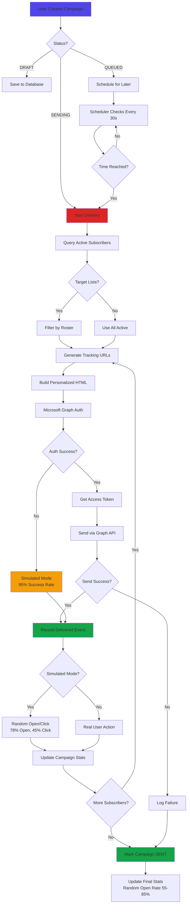
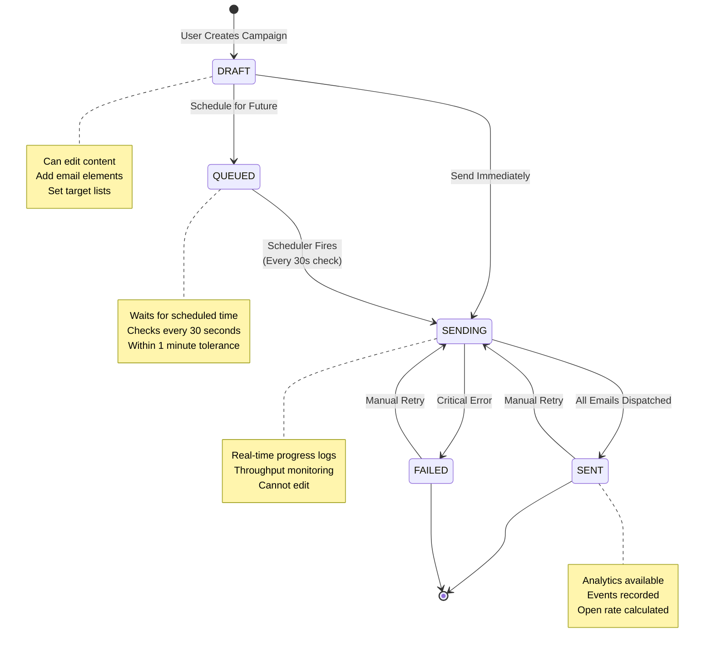
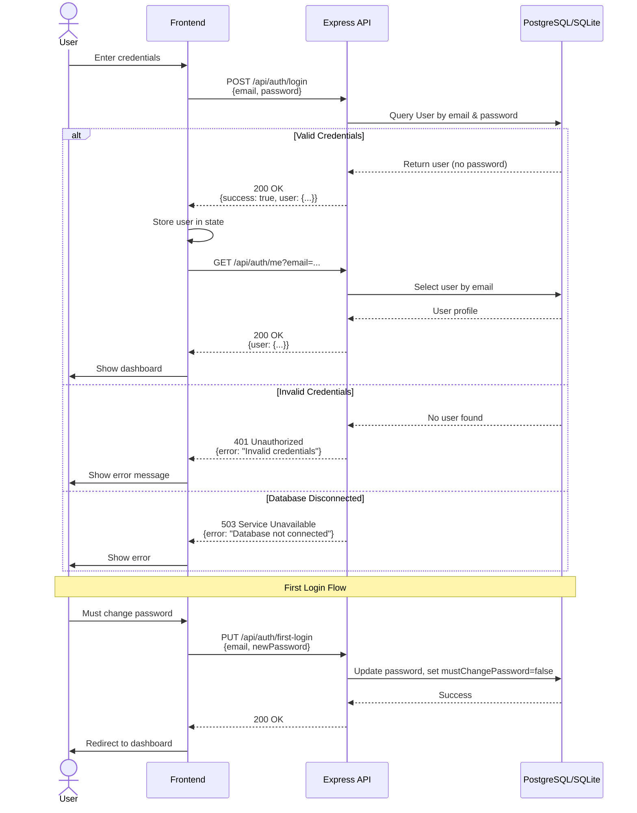
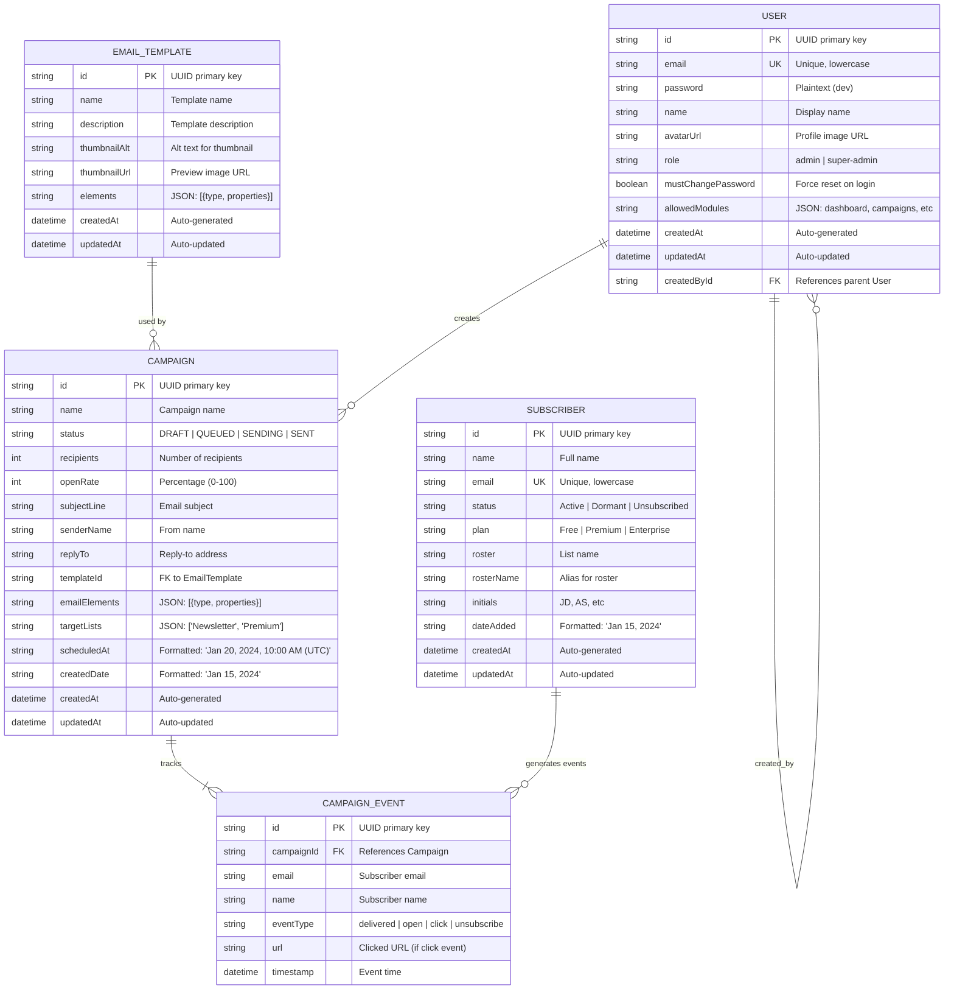
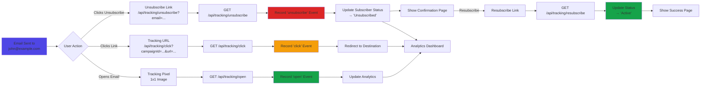
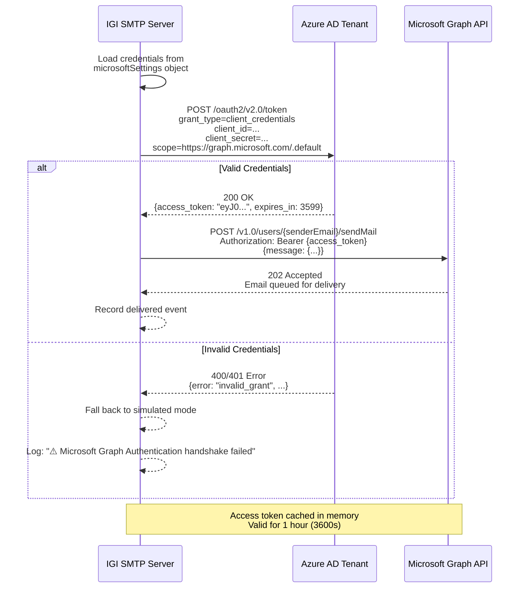
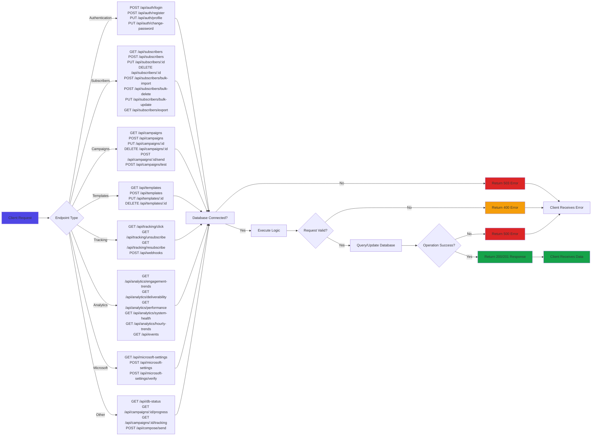

# Diagrams.md - Visual Flow Charts & Architecture

This document contains visual diagrams and flow charts for the IGI SMTP Platform. All diagrams use Mermaid syntax for easy rendering in GitHub, Markdown viewers, and documentation tools.

## Table of Contents

1. [System Architecture](#system-architecture)
2. [Email Delivery Flow](#email-delivery-flow)
3. [Campaign Lifecycle](#campaign-lifecycle)
4. [API Authentication Flow](#api-authentication-flow)
5. [Database Schema (ERD)](#database-schema-erd)
6. [Tracking System Flow](#tracking-system-flow)
7. [Deployment Architecture](#deployment-architecture)
8. [Subscriber Import Flow](#subscriber-import-flow)

---

## System Architecture

```mermaid
graph TB
    subgraph "Client Layer"
        A[React Frontend<br/>Vite + Tailwind CSS]
        B[Mobile Browser]
        C[Desktop Browser]
    end

    subgraph "Server Layer"
        D[Express.js Server<br/>Port 3000]
        E[API Routes<br/>/api/*]
        F[Business Logic<br/>Campaign Engine]
        G[Email Renderer<br/>HTML Builder]
    end

    subgraph "Data Layer"
        H[(PostgreSQL<br/>Production)]
        I[(SQLite<br/>Development)]
        J[Prisma ORM]
    end

    subgraph "External Services"
        K[Microsoft Graph API<br/>OAuth2 Client Credentials]
        L[Nginx Reverse Proxy<br/>Port 443]
        M[PM2 Process Manager]
    end

    A --> L
    B --> L
    C --> L
    L --> D
    D --> E
    E --> F
    F --> G
    G --> K
    D --> J
    J --> H
    J --> I
    M --> D

    style A fill:#4f46e5
    style D fill:#000066
    style K fill:#0078d4
    style H fill:#336791
    style L fill:#38b2ac
```



**Description:** High-level system architecture showing the flow from frontend through Nginx reverse proxy to Express backend, with Microsoft Graph API integration for email delivery and dual database support (PostgreSQL for production, SQLite for development).

---

## Email Delivery Flow



**Description:** Complete email delivery flow from campaign creation through subscriber filtering, Microsoft Graph authentication, email sending with simulated fallback, event tracking, and campaign completion.

---

## Campaign Lifecycle



**Description:** Campaign state machine showing all possible states (DRAFT, QUEUED, SENDING, SENT, FAILED) and transitions between them.

---

## API Authentication Flow



**Description:** Authentication sequence diagram showing login flow, session recovery, and first-time password change.

---

## Database Schema (ERD)



**Description:** Entity Relationship Diagram showing all database tables, their fields, data types, primary keys (PK), foreign keys (FK), and relationships between entities.

---

## Tracking System Flow



**Description:** Tracking system flow showing how opens, clicks, unsubscribes, and resubscribes are tracked through dedicated API endpoints.

---

## Deployment Architecture

```mermaid
graph TB
    subgraph "Internet"
        A[User Browser]
        B[Email Recipients]
    end

    subgraph "VPS Server (Ubuntu 22.04/24.04)"
        subgraph "Network Layer"
            C[UFW Firewall<br/>Ports: 22, 80, 443]
            D[Nginx Web Server<br/>Reverse Proxy]
        end

        subgraph "SSL/TLS Layer"
            E[Let's Encrypt<br/>Certbot Auto-Renewal]
            F[SSL Certificate<br/>Fullchain + Private Key]
        end

        subgraph "Application Layer"
            G[PM2 Process Manager<br/>Auto-restart, Monitoring]
            H[Node.js 20 LTS<br/>dist/server.cjs]
            I[Express App<br/>Port 3000]
        end

        subgraph "Data Layer"
            J[PostgreSQL 14+<br/>Port 5432]
            K[Prisma ORM<br/>Connection Pool]
        end

        subgraph "Storage Layer"
            L[Backup Scripts<br/>Daily Cron 2AM]
            M[Application Files<br/>/var/www/igi-smtp]
        end
    end

    subgraph "External Services"
        N[Microsoft Graph API<br/>graph.microsoft.com]
        O[Azure AD<br/>OAuth2 Provider]
    end

    A -->|HTTPS| C
    C --> D
    D -->|HTTP 80| E
    D -->|HTTPS 443| F
    F --> G
    G --> H
    H --> I
    I --> K
    K --> J
    G -->|SMTP| N
    N -->|OAuth2| O

    L -->|pg_dump| J
    M -->|Code| H

    style A fill:#4f46e5
    style D fill:#38b2ac
    style H fill:#000066
    style J fill:#336791
    style N fill:#0078d4
```



**Description:** Production deployment architecture showing Nginx reverse proxy, PM2 process management, PostgreSQL database, SSL termination, firewall rules, backup strategy, and Microsoft Graph API integration.

---

## Subscriber Import Flow

```mermaid
flowchart TD
    A[Admin Uploads JSON] --> B{File Valid?}
    B -->|No| C[Return Error<br/>400 Bad Request]
    B -->|Yes| D[Parse JSON Array]

    D --> E[Loop Through Subscribers]
    E --> F{Valid Email?<br/>Contains @}

    F -->|No| G[Mark as Skipped<br/>Invalid email]
    F -->|Yes| H[Normalize Data<br/>Lowercase email<br/>Extract name<br/>Set defaults]

    H --> I{Email Exists?}
    I -->|No| J[Create New Subscriber]
    I -->|Yes| K{Overwrite?}

    K -->|Yes| L[Update Existing]
    K -->|No| G

    J --> M{Create Success?}
    L --> N{Update Success?}

    M -->|Yes| O[Mark: Created]
    M -->|No| P[Mark: Skipped<br/>Log error]
    N -->|Yes| Q[Mark: Updated]
    N -->|No| P

    O --> R[Add to Results]
    Q --> R
    G --> R
    P --> R

    R --> S{More Subscribers?}
    S -->|Yes| E
    S -->|No| T[Invalidate Cache]

    T --> U[Return Summary<br/>{total, created,<br/>updated, skipped,<br/>results}]

    style A fill:#4f46e5
    style O fill:#16a34a
    style Q fill:#38b2ac
    style G fill:#f59e0b
    style P fill:#dc2626
    style U fill:#16a34a
```

**Description:** Bulk subscriber import flow showing validation, normalization, upsert logic, cache invalidation, and summary response generation.

---

## Microsoft Graph Authentication Flow



**Description:** OAuth2 client credentials flow with Azure AD to obtain Microsoft Graph access token for sending emails.

---

## API Request Flow



**Description:** Complete API request flow showing endpoint categorization, database connection checks, validation, and response handling.

---

## Template Rendering Process

```mermaid
flowchart TD
    A[Campaign Email Elements] --> B{Element Type?}

    B -->|text| C[Render Text Block<br/>Font, Color, Padding]
    B -->|button| D[Render Button<br/>Text, URL, Colors, Radius<br/>Wrap URL with tracking]
    B -->|image| E[Render Image<br/>URL, Height, Width<br/>Lazy loading]
    B -->|spacer| F[Render Spacer<br/>Vertical height]
    B -->|divider| G[Render Divider<br/>Horizontal rule, color]
    B -->|html| H[Render Custom HTML<br/>Raw HTML snippet]

    C --> I[Wrapped in styled div]
    D --> I
    E --> I
    F --> I
    G --> I
    H --> I

    I --> J[Concatenate All Elements]
    J --> K[Wrap in Email Container<br/>Header with brand color #000066<br/>IGI Logo<br/>Footer with unsubscribe link]

    K --> L[Inject Personalization<br/>Replace {{name}} with<br/>subscriber name]

    L --> M[Final HTML Email]
    M --> N[Send via Microsoft Graph API<br/>or Simulated Mode]

    style A fill:#4f46e5
    style M fill:#16a34a
    style N fill:#0078d4
```

**Description:** Email template rendering pipeline showing how structured element arrays are converted to HTML emails with tracking, personalization, and branding.

---

## Data Flow: Campaign Creation to Delivery

```mermaid
flowchart LR
    A[Admin Creates Campaign] --> B[POST /api/campaigns<br/>Status: DRAFT]

    B --> C{Status = SENDING?}
    C -->|No| D[Store in Database]
    C -->|Yes| E[Trigger Immediate Send]

    D --> F[Admin Updates to QUEUED<br/>scheduledAt: "Jan 20, 2024, 10:00 AM (UTC)"]

    F --> G[Scheduler (30s interval)]
    G --> H{Time Reached?}
    H -->|No| G
    H -->|Yes| E

    E --> I[triggerCampaignSend function]
    I --> J[Query Active Subscribers]
    J --> K[Filter by targetLists]
    K --> L[Microsoft Graph Auth]

    L --> M{Send Loop}
    M --> N[Generate HTML per subscriber]
    N --> O[Send Email]
    O --> P[Record Event]
    P --> Q[Update Stats]
    Q --> R{More Subscribers?}
    R -->|Yes| M
    R -->|No| S[Mark SENT<br/>Calculate open rate]

    S --> T[Available in Analytics]

    style A fill:#4f46e5
    style B fill:#f59e0b
    style F fill:#f59e0b
    style E fill:#dc2626
    style S fill:#16a34a
    style T fill:#16a34a
```

**Description:** End-to-end data flow from campaign creation through scheduling to final delivery and analytics availability.

---

## Caching Strategy

```mermaid
flowchart TD
    A[API Request] --> B{Check Cache}

    B -->|Cache Hit| C[Return Cached Data<br/>TTL: 30 seconds]
    B -->|Cache Miss| D[Query Database]

    D --> E[Store in Cache<br/>setCache with TTL]
    E --> F[Return Data]

    C --> G[Client Response]

    subgraph "Cache Operations"
        H[invalidateCache pattern]
        I{Pattern provided?}
        I -->|No| J[Clear all cache<br/>cache.clear()]
        I -->|Yes| K[Delete matching keys<br/>key.startsWith pattern]
    end

    L[Data Modification<br/>CREATE/UPDATE/DELETE] --> H
    H --> M{Cache Cleared}

    subgraph "Cache Keys"
        N[subscribers:all]
        O[campaigns:all]
        P[templates:all]
        Q[subscribers:export]
    end

    style A fill:#4f46e5
    style C fill:#16a34a
    style F fill:#16a34a
    style M fill:#f59e0b
```

**Description:** Caching implementation showing fetch-or-cache pattern, TTL-based expiration, and invalidation triggers on data modifications.

---

## Rendering These Diagrams

### In GitHub / GitLab
Mermaid diagrams render automatically in GitHub README files and GitLab Markdown.

### In VS Code
Install the "Markdown Preview Mermaid Support" extension to view diagrams in preview mode.

### Online
Use the Mermaid Live Editor: https://mermaid.live/

### Export to Images
1. Copy the Mermaid code block
2. Paste into https://mermaid.live/
3. Click "Actions" → "Export as PNG/SVG"

### Embedding in Documentation
The diagrams can be directly added to ReadMe.md, Backend.md, Guideline.md, or Documentation.md files.

---

## Diagram Summary

| Diagram | Purpose | Complexity |
|---------|---------|------------|
| System Architecture | High-level overview of components | Medium |
| Email Delivery Flow | Complete delivery pipeline end-to-end | High |
| Campaign Lifecycle | State machine for campaign statuses | Low |
| API Authentication Flow | Login and session management sequence | Medium |
| Database Schema (ERD) | Complete database structure | High |
| Tracking System Flow | Click, open, unsubscribe tracking | Medium |
| Deployment Architecture | Production VPS setup | Medium |
| Subscriber Import Flow | Bulk import validation and processing | Medium |
| Microsoft Graph Auth | OAuth2 authentication sequence | Medium |
| API Request Flow | Request routing and handling | High |
| Template Rendering | HTML email generation process | Medium |
| Data Flow Campaign | Campaign creation to delivery pipeline | High |
| Caching Strategy | Cache implementation and invalidation | Low |

All diagrams use standard Mermaid syntax compatible with GitHub, GitLab, and most modern documentation viewers.